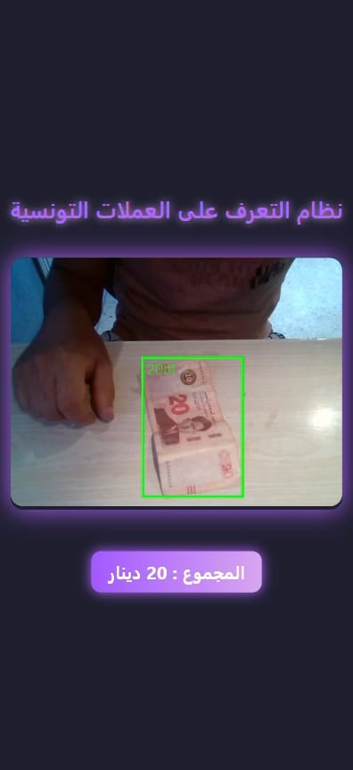
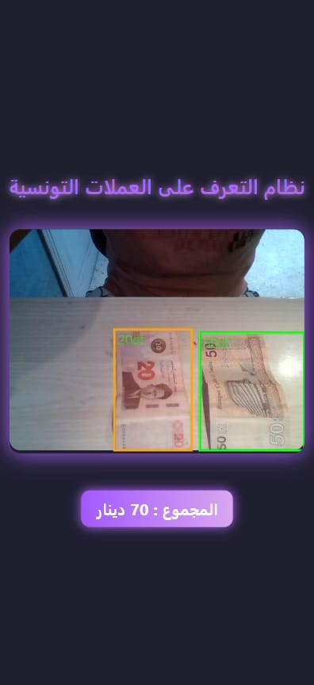

# Tunisia Coin Detection App 🪙

 <!-- Remplace par ton screenshot -->


## Description

**Tunisia Coin Detection App** est une application intelligente qui détecte automatiquement les pièces de monnaie tunisiennes et calcule leur total.  
Le projet inclut la **création d’un dataset personnalisé**, l’**entraînement d’un modèle YOLOv8** et son intégration dans une application React.js pour la détection en temps réel et la synthèse vocale en arabe.  

---

## Fonctionnalités principales

- 🎥 **Détection en temps réel** des pièces tunisiennes via webcam.  
- 🗣️ **Annonce vocale** du total détecté en arabe.  
- 🖼️ **Encadrement visuel** des pièces détectées.  
- 💜 **Interface moderne et responsive**.  
- 💻 **Dataset personnalisé** pour entraînement sur toutes les pièces tunisiennes.  

---
## Classes de pièces détectées

| Nom | Valeur |
|-----|--------|
| 50m  | 0.050 Dinar |
| 100m | 0.100 Dinar |
| 200m | 0.200 Dinar |
| 500m | 0.500 Dinar |
| 1dt  | 1 Dinar |
| 2dt  | 2 Dinars |
| 5dt  | 5 Dinars |
| 10dt | 10 Dinars |
| 20dt | 20 Dinars |
| 50dt | 50 Dinars |

---

## Pipeline du projet

1. **Construction du dataset personnalisé**  
   - Prendre plusieurs photos des pièces sous différents angles et conditions d’éclairage.  
   - Annoter chaque image avec [LabelImg](https://github.com/heartexlabs/labelImg) ou un autre outil YOLO.  
   - Sauvegarder les annotations au format YOLO (fichier `.txt` par image).  

2. **Entraînement du modèle YOLOv8**  
   - Installer Ultralytics YOLOv8 (`pip install ultralytics`).  
   - Préparer le fichier `data.yaml` avec :
     ```yaml
     train: path/to/train/images
     val: path/to/val/images
     nc: 5  # nombre de classes (ex: 100m, 200m, 500m, 1d, 2d)
     names: ["100m", "200m", "500m", "1d", "2d"]
     ```  
   - Lancer l’entraînement :
     ```bash
     yolo task=detect mode=train model=yolov8n.pt data=data.yaml epochs=50 imgsz=640
     ```  
   - Le modèle entraîné sera sauvegardé dans le dossier `runs/detect/train`.  

3. **Intégration dans l’application**  
   - Copier le fichier du modèle `best.pt` dans le backend.  
   - Le backend FastAPI reçoit les images webcam et utilise YOLOv8 pour détecter les pièces.  
   - Le total est calculé et renvoyé au frontend pour affichage et lecture vocale.  

---

## Installation

### Backend

```bash
cd Backend
python -m venv venv
# Windows
venv\Scripts\activate
# Linux/Mac
source venv/bin/activate

pip install -r requirements.txt
uvicorn main:app --reload --host 0.0.0.0 --port 8000
